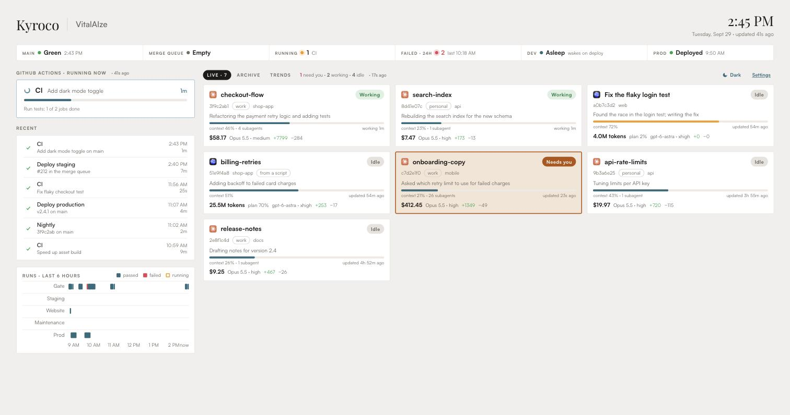
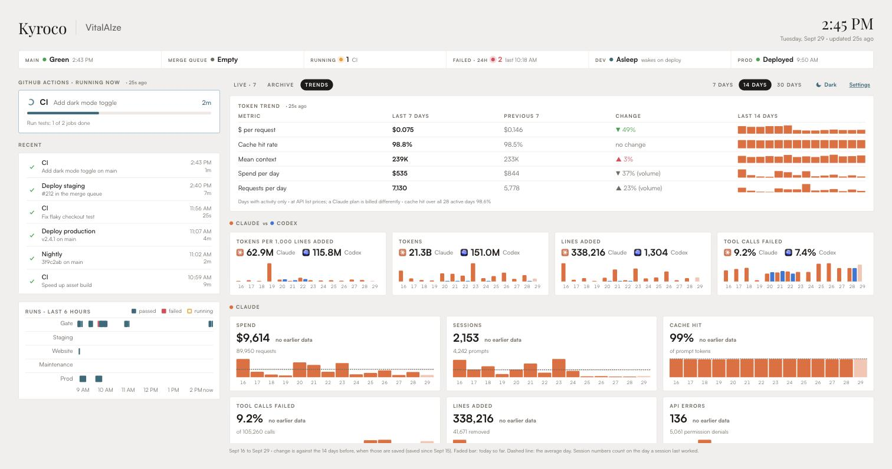
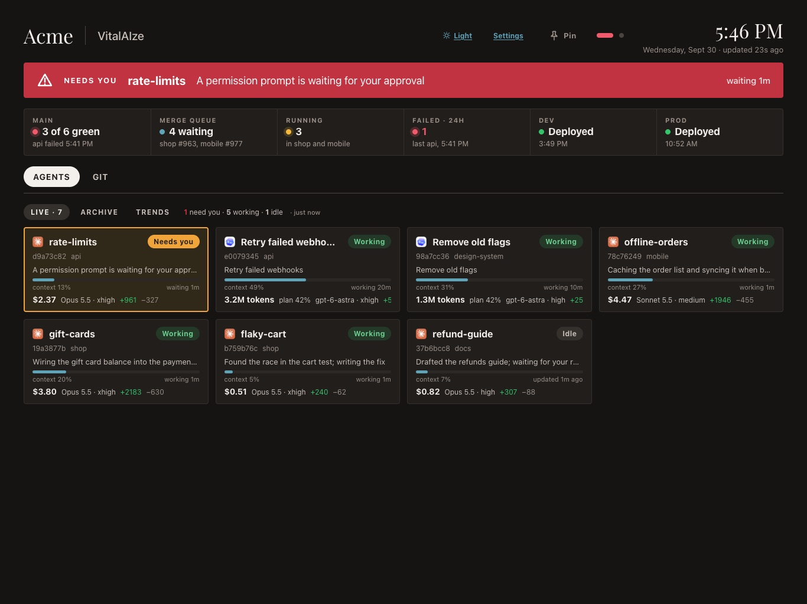

# Kyroco VitalAIze

VitalAIze is a wall screen for teams that build software with AI coding
agents. Put it on an iPad (or any browser) and at a glance you see every
Claude Code and Codex session at work, which one is waiting on you, what your
GitHub builds are doing, and how the work trends over days and weeks.

It runs on your own Mac or Linux machine. Your session data is never sent
anywhere except between your own machines, if you connect more than one.



## What it shows

- **Live sessions.** One card per Claude Code or Codex session, marked with
  that tool's icon. Each card says whether the session is working (green), idle,
  or needs you (orange), plus how full its context is, its model and effort,
  lines added and removed, its helper agents, and its cost (Claude) or tokens
  and plan use (Codex).
- **Needs you.** When a Claude session stops to ask you something, a banner
  runs across the screen and its card moves to the top. Your Mac can also
  text you.
- **GitHub Actions.** What is running, recent runs, a timeline of the last 6
  hours, and tiles for main, the merge queue, failures and your last deploys.
- **Archive.** Every session is saved in a small SQLite database on the
  machine that runs the board, so you can look back at any one: what it cost,
  what tools it used, what it changed.
- **Trends.** A chart per measure, one bar per day: spend, tokens, cache hits,
  failed tool calls, lines added, GitHub run times and more. If you use both
  Claude and Codex, a row compares them, starting with how many tokens each
  spends per 1,000 lines of code. Hover over or tap any bar for its value.
- **Korium** (optional). If your agents use [Korium](https://korium.ai), how
  often their memory searches find something, how many saves work, and how
  often code searches hit. See [About Korium](#about-korium).
- **Production health** (optional). A second page with checks from New Relic.
- **Light and dark.** Switch with the button next to Settings.





## Install on a Mac

1. Download `VitalAIze-<version>.pkg` from the
   [latest release](https://github.com/kyroco/vitalaize/releases/latest)
   and open it. It is signed and notarized by Apple.
2. The installer says what it will do, then puts VitalAIze in your
   Applications folder and opens it.
3. VitalAIze asks what this Mac does:
   - **Hub and collector**, for your main Mac: it runs the board and saves
     this Mac's sessions.
   - **Hub only**: it runs the board and keeps what other Macs send it.
   - **Collector only**, for your other Macs: it sends this Mac's sessions to
     a hub. It finds hubs on your network by itself; you paste the hub's key
     from the hub's Settings page (Connect another Mac).
4. It fills in what it can find (your Claude and Codex folders, the GitHub
   repository your sessions work in and its workflows, your AWS profiles) and
   asks you to check it. Click **Install**. The board starts now and again
   every time you log in.
5. On your iPad, open the address VitalAIze shows in Safari, tap Share, then
   **Add to Home Screen**. Opened from the Home Screen, the board fills the
   screen. Turn the iPad sideways, and set Auto-Lock to Never in the iPad's
   Display & Brightness settings so the screen stays on.

Open VitalAIze again any time to see the board, restart it, change the setup
or remove it.

## Install on Linux

1. Download `vitalaize-<version>-linux-x86_64.tar.gz` (Intel and AMD) or
   `vitalaize-<version>-linux-arm64.tar.gz` (ARM) from the
   [latest release](https://github.com/kyroco/vitalaize/releases/latest).
   It carries everything it runs on; you do not need Elixir or Erlang. It
   runs on Ubuntu 22.04 or newer, Debian 12 or newer, and other Linux systems
   of the same age or newer, and needs OpenSSL 3 (`libssl3`), which they
   already have.
2. Unpack it and make your settings file:

   ```
   tar -xzf vitalaize-*-linux-*.tar.gz
   cd vitalaize
   cp settings.example.exs settings.exs     # then edit it
   ```

3. Try it: `WALLBOARD_SETTINGS=$PWD/settings.exs bin/wallboard start`. It
   prints the address to open.
4. To keep it running, and start it whenever you log in:
   `./systemd.sh on` (`./systemd.sh off` turns it off). To keep it running
   after you log out too, run `loginctl enable-linger $USER` once.

What differs from a Mac: there is no setup app, so you edit `settings.exs`;
text alerts need a Mac (they use Messages); and the database lives in
`~/.local/share/vitalaize`. To have other machines find the hub on the
network by themselves, install `avahi-utils` on the hub; without it,
collectors type the hub's address. A Linux machine can be a collector too:
run the command from the hub's Settings page (Connect another Mac) there. It
needs `python3` and `curl`.

## What you need

- A Mac with Apple silicon (M1 or newer), or a Linux machine (see above).
  You do not need Elixir or Erlang to use the installer or the Linux
  download; they carry everything they run on.
- [Claude Code](https://docs.anthropic.com/en/docs/claude-code) (the `claude`
  command), signed in.
- The [GitHub CLI](https://cli.github.com) (`gh`), signed in with
  `gh auth login`.
- Optional: [Codex](https://github.com/openai/codex), for Codex sessions.
- Optional: the AWS CLI (`aws`) with read-only profiles, to show whether dev
  is awake and whether prod runs the same build as dev.
- Optional: New Relic and the 1Password CLI (`op`), for the production page.
- Optional: the Messages app signed in, for text alerts.

## Build from source

You need Elixir 1.18 or newer and Erlang/OTP, plus a C compiler (Xcode's
command line tools on a Mac) for the SQLite driver.

```
git clone https://github.com/kyroco/vitalaize.git
cd vitalaize
mix deps.get
cp settings.example.exs settings.exs     # then edit it
MIX_ENV=prod mix release
_build/prod/rel/wallboard/bin/wallboard start
```

It prints the address to open, like `Board is up: http://192.168.1.20:4747/`.
To keep it running (it starts when you log in and again if it ever stops),
run `scripts/login-item.sh on` on a Mac or `scripts/systemd.sh on` on Linux;
`off` turns either one off.

Everything specific to you lives in `settings.exs`. The example file explains
each setting. At the least, set `github.repo` and the workflow file names, and
`claude.config_dirs` if your Claude folder is not `~/.claude`. Anything you
leave out uses the default shown in the example file.

To build the Mac app and its installer yourself: `macos/build.sh`. With an
Apple Developer ID it signs them, and with `--notary-profile NAME` it also
notarizes them (see the top of the script).

Run the tests with `mix test`.

## Settings you may want

- **Keep it private.** Anyone on the same network can open the board. It is
  read-only and shows no keys, but it does show pull request titles and what
  your sessions ask you. Set `token` in `settings.exs` (or a board password on
  the Settings page); the first visit from each device then needs
  `/?token=<your token>` at the end of the address.
- **Text alerts.** Set `alerts.phone` to your number. The Mac running the
  board sends an iMessage from the Apple ID signed in there, once each time a
  session starts waiting on you. The first time, macOS asks whether the board
  may control Messages. If the number is not on iMessage, set `alerts.via` to
  `"SMS"` (needs Text Message Forwarding on your iPhone).
- **Codex.** On by default, reading `~/.codex/sessions`. Codex runs on a plan
  rather than per-token prices, so its cards show tokens and plan use. Codex
  writes nothing while it waits on you, so a Codex session never shows as
  needing you. Set `codex: %{enabled: false}` to leave it out.
- **Production page.** Set `new_relic: %{enabled: false}` if you do not use
  New Relic. Otherwise set `api_key_ref` to where your New Relic User API key
  lives in 1Password (`"op://Vault/Item/field"`), `account_id`, and the
  `checks` to show. The key is read once at start and kept in memory only.
- **Dev awake or asleep.** If your dev environment sleeps at night, set
  `dev_power.aws_profile`, `database` and `cluster`, and the Dev tile shows
  Awake, Asleep, Waking or Going to sleep.
- **Prod builds.** Set `builds.prod_profile` and the ECR repository and ECS
  services, and the Prod tile says whether prod runs the same build as dev.
- **Costs.** Claude costs use the API list prices in `usage.prices`. On a
  Claude plan your bill is different; read the dollars as a measure of work.
- **Your look.** The `theme` section holds every color and font, and `brand`
  holds the name and logo in the header.

## About Korium

[Korium](https://korium.ai) is another Kyroco project: shared company memory
for people and AI agents. It keeps your team's decisions, with the reasons and
sources behind them, so an agent can look up what the team already learned
before it starts. It also gives agents code search tied to specific commits,
reusable skills and workflows, and a Mac command line tool that indexes code
locally. It works with Claude, OpenAI, Gemini and other assistants.

VitalAIze does not need Korium. When your sessions use it, the Trends tab
shows a Korium section: memory searches that found something, saves that
worked, and code searches that hit. Set `korium: %{enabled: false}` to hide
it. Learn more at [korium.ai](https://korium.ai).

## How it keeps up

Each source has its own timer: sessions every few seconds, GitHub every 30
seconds (well inside GitHub's limit), New Relic every minute. Only what changed
is sent to the screen. If one source fails, its panel keeps its last good
data, says how old it is and why, and the rest of the board carries on. Trends
say "Loading…" beside a section while its history is still coming in.

## If something is off

- **The iPad cannot reach the board.** Check that both are on the same Wi-Fi,
  and that the firewall allows incoming connections on the board's port
  (4747 unless you changed it): on a Mac in System Settings, Network,
  Firewall; on Linux with ufw, `sudo ufw allow 4747/tcp`.
- **"Add ?token= ..." on the page.** You set a `token`, and the address is
  missing it or has a different one.
- **A panel shows "stale" in red.** It says why. Usually `gh` or `claude` is
  signed out, or the Mac lost its connection.
- **No texts.** Check `alerts.phone`, that Messages is signed in, and that
  macOS allowed the board to control Messages (System Settings, Privacy &
  Security, Automation).

## License

Apache License 2.0. See [LICENSE](LICENSE) and [NOTICE](NOTICE).

Claude is a trademark of Anthropic, and Codex of OpenAI. VitalAIze is not
made by or affiliated with either; it shows their icons only to mark which
tool ran a session.
